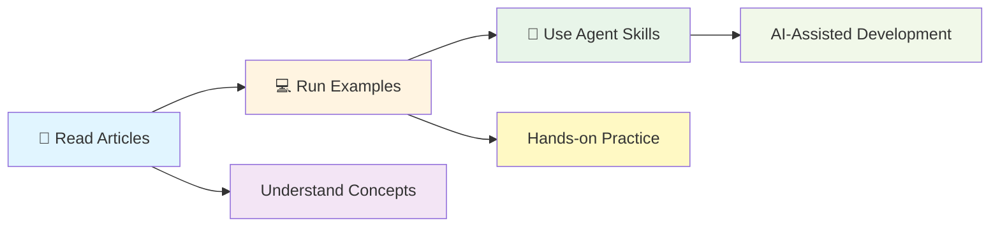
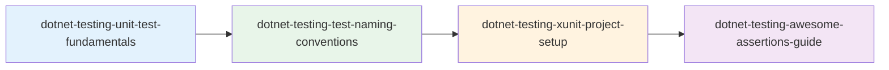
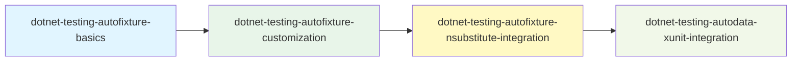
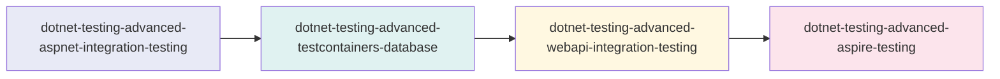

# .NET Testing Agent Skills

[](https://opensource.org/licenses/MIT)
[](https://dotnet.microsoft.com/)
[](https://xunit.net/)
[](https://xunit.net/)

> 🏆 Based on the **2025 iThome Ironman Software Development Competition Champion** work "Old School Software Engineer's Testing Practice - 30 Day Challenge"

A collection of AI Agent Skills designed for .NET developers, covering complete best practices from unit testing to integration testing. Let GitHub Copilot, Claude, and other AI assistants automatically provide professional testing guidance for you!

---

## ✨ Features

- 🎯 **Official Standards Compliant**: 29 skills with descriptions containing Keywords for AI to auto-load based on conversation context
- 🧠 **Anthropic Best Practices**: Fully optimized according to the official "[The Complete Guide to Building Skills for Claude](https://claude.com/blog/complete-guide-to-building-skills-for-claude)", adopting Progressive Disclosure architecture
- 📚 **29 Refined Skills**: Including 2 overview skills + 27 professional skills, covering unit testing, mocking, test data generation, integration testing, and more
- 🔧 **Ready-to-Use Templates**: Providing complete project structure and code examples
- 🌐 **Multi-Platform Support**: GitHub Copilot, Claude Code, Cursor, and more
- 📖 **Chinese Friendly**: Complete Traditional Chinese documentation and naming suggestions
- 📦 **Standardized Structure**: Compliant with Claude Code skills standards, supports npx skills install
- 📊 **2026-02-01 Comprehensive Optimization**: Enhanced Descriptions (with Keywords), entry navigation
- 📐 **2026-02-11 Anthropic Standards Optimization**: Adjusted 29 SKILL.md structures and content based on the official Skill creation guide

---

## 🚀 Quick Start

### Method 1: Using npx skills install (Recommended)

```bash
# Install directly from GitHub to Claude Code global skills
npx skills install https://github.com/kevintsengtw/dotnet-testing-agent-skills.git

# Or install to current workspace
npx skills install https://github.com/kevintsengtw/dotnet-testing-agent-skills.git --workspace
```

### Method 2: Direct Copy

#### Copy to GitHub Copilot (VS Code)

**Linux / macOS (Bash)**
```bash
# 1. Clone this repo
git clone https://github.com/kevintsengtw/dotnet-testing-agent-skills.git

# 2. Copy to your project (GitHub Copilot uses .github/skills)
cp -r dotnet-testing-agent-skills/skills /your-project/.github/

# 3. VS Code v1.109+ has Agent Skills enabled by default, no manual setup needed
#    Older VS Code: Settings → Search "chat.useAgentSkills" → Check to enable
```

**Windows (PowerShell)**
```powershell
# 1. Clone this repo
git clone https://github.com/kevintsengtw/dotnet-testing-agent-skills.git

# 2. Copy to your project (GitHub Copilot uses .github/skills)
Copy-Item -Path "dotnet-testing-agent-skills\skills" -Destination "\your-project\.github\" -Recurse

# 3. VS Code v1.109+ has Agent Skills enabled by default, no manual setup needed
#    Older VS Code: Settings → Search "chat.useAgentSkills" → Check to enable
```

#### Copy to Claude Code

**Linux / macOS (Bash)**
```bash
# Copy to Claude Code workspace skills
cp -r dotnet-testing-agent-skills/skills /your-project/.claude/

# Or copy to global skills
cp -r dotnet-testing-agent-skills/skills ~/.config/claude/
```

**Windows (PowerShell)**
```powershell
# Copy to Claude Code workspace skills
Copy-Item -Path "dotnet-testing-agent-skills\skills" -Destination "\your-project\.claude\" -Recurse

# Or copy to global skills
Copy-Item -Path "dotnet-testing-agent-skills\skills" -Destination "$env:APPDATA\claude\" -Recurse
```

### Method 3: Git Submodule

```bash
cd /your-project

# For GitHub Copilot: Add submodule to .github/skills
git submodule add https://github.com/kevintsengtw/dotnet-testing-agent-skills .github/skills
cd .github/skills && cp -r skills/* . && cd ../..

# For Claude Code: Add submodule to .claude/skills
git submodule add https://github.com/kevintsengtw/dotnet-testing-agent-skills .claude/skills
cd .claude/skills && cp -r skills/* . && cd ../..
```

### Method 4: Selective Copy

Only need specific skills?

#### Linux / macOS (Bash)

```bash
# Copy only unit test fundamentals
cp -r dotnet-testing-agent-skills/skills/dotnet-testing-unit-test-fundamentals /your-project/.github/skills/

# Copy only AutoFixture series
cp -r dotnet-testing-agent-skills/skills/dotnet-testing-autofixture-* /your-project/.github/skills/

# Copy only overview skills
cp -r dotnet-testing-agent-skills/skills/dotnet-testing /your-project/.github/skills/
cp -r dotnet-testing-agent-skills/skills/dotnet-testing-advanced /your-project/.github/skills/
```

#### Windows (PowerShell)

```powershell
# Copy only unit test fundamentals
Copy-Item -Path "dotnet-testing-agent-skills\skills\dotnet-testing-unit-test-fundamentals" -Destination "\your-project\.github\skills\" -Recurse

# Copy only AutoFixture series
Get-ChildItem -Path "dotnet-testing-agent-skills\skills\dotnet-testing-autofixture-*" | Copy-Item -Destination "\your-project\.github\skills\" -Recurse

# Copy only overview skills
Copy-Item -Path "dotnet-testing-agent-skills\skills\dotnet-testing" -Destination "\your-project\.github\skills\" -Recurse
Copy-Item -Path "dotnet-testing-agent-skills\skills\dotnet-testing-advanced" -Destination "\your-project\.github\skills\" -Recurse
```

---

## Directory Structure

```text
skills/
├── dotnet-testing/                              # ⭐ Overview: Basic Skills Navigation (19 sub-skills)
├── dotnet-testing-advanced/                     # ⭐ Overview: Advanced Skills Navigation (8 sub-skills)
├── dotnet-testing-unit-test-fundamentals/
├── dotnet-testing-test-naming-conventions/
├── dotnet-testing-xunit-project-setup/
├── dotnet-testing-awesome-assertions-guide/
├── dotnet-testing-complex-object-comparison/
├── dotnet-testing-code-coverage-analysis/
├── dotnet-testing-nsubstitute-mocking/
├── dotnet-testing-test-output-logging/
├── dotnet-testing-private-internal-testing/
├── dotnet-testing-fluentvalidation-testing/
├── dotnet-testing-datetime-testing-timeprovider/
├── dotnet-testing-filesystem-testing-abstractions/
├── dotnet-testing-test-data-builder-pattern/
├── dotnet-testing-autofixture-basics/
├── dotnet-testing-autofixture-customization/
├── dotnet-testing-autodata-xunit-integration/
├── dotnet-testing-autofixture-nsubstitute-integration/
├── dotnet-testing-bogus-fake-data/
├── dotnet-testing-autofixture-bogus-integration/
├── dotnet-testing-advanced-aspnet-integration-testing/
├── dotnet-testing-advanced-testcontainers-database/
├── dotnet-testing-advanced-testcontainers-nosql/
├── dotnet-testing-advanced-webapi-integration-testing/
├── dotnet-testing-advanced-aspire-testing/
├── dotnet-testing-advanced-xunit-upgrade-guide/
├── dotnet-testing-advanced-tunit-fundamentals/
└── dotnet-testing-advanced-tunit-advanced/
```

> **Note**:
> - Skills use a flat structure with prefix naming to distinguish basic skills (`dotnet-testing-*`) from advanced skills (`dotnet-testing-advanced-*`)
> - ⭐ Two overview skills provide intelligent navigation, automatically recommending suitable sub-skill combinations
> - Each skill directory may contain `templates/` (templates) and `references/` (reference files) subdirectories, adopting Progressive Disclosure architecture
> - After installation, skills are copied to the corresponding location based on the target environment (`.github/skills/` or `.claude/skills/`)

---

## 📖 Quick Reference Guide (Recommended)

To help you quickly get started and make full use of these skills, we provide complete reference guides:

### `SKILLS_QUICK_REFERENCE.md` (v2.0.0 Merged Version)

**Skills Quick Reference Guide** - Integrated AI Agent and Developer Usage Guide

**For AI Agents**:
- 🔍 **Keyword Quick Mapping Table**: 20 common scenarios keyword → Skill mapping
- 🚀 **AI Agent Workflow Templates**: 4-step automation process instructions

**For Developers**:
- 💬 **Prompt Templates**: 3 recommended conversation templates
- 🎯 **Common Scenario Combinations**: 3 complete usage scenario examples
- 📋 **Complete Skill Catalog**: 27 skills categorized list
- 📊 **Skills Optimization Status**: Keywords integration, expected effect description

**Usage**:
```bash
# Method 1: Copy as reference file (Recommended)
cp SKILLS_QUICK_REFERENCE.md /your-project/SKILLS_QUICK_REFERENCE.md

# Method 2: Integrate into existing documents
# If the project already has similar reference documents, manually integrate the content
```

**👉 Why do you need this guide?**

Although overview skills (`dotnet-testing` and `dotnet-testing-advanced`) provide intelligent navigation, the quick reference guide can:

1. ✅ **Quick Query**: Immediately find answers when unsure which skill to use
2. ✅ **Example Prompts**: Provide conversation examples ready to copy and use
3. ✅ **Scenario Combinations**: Show practical multi-skill usage cases
4. ✅ **Lower Learning Curve**: No need to remember all skill names

---

## Skill List

### 🎯 Overview Skills (2) - New!

> **NEW!** Two overview skills provide intelligent navigation. When unsure which skill to use, they automatically analyze needs and recommend suitable skill combinations.

| Skill | Description | When to Use |
|-------|-------------|-------------|
| `dotnet-testing` | Basic Testing Skills Overview and Navigation Center | Automatically triggered when asking general questions like "How to write .NET tests", "Testing introduction" |
| `dotnet-testing-advanced` | Advanced Testing Skills Overview and Navigation Center | Automatically triggered for advanced needs like "Integration testing", "API testing", "Microservice testing" |

**Overview Skills Value**:
- ✅ **Smart Recommendations**: Based on your specific needs, recommend 1-4 most suitable sub-skill combinations
- ✅ **Learning Paths**: Provide progressive learning suggestions (beginner path, advanced path)
- ✅ **Decision Support**: Quickly find needed skills through decision trees
- ✅ **Example Oriented**: Complete prompt examples for each task

### Basic Skills (19)

<details>
<summary>Phase 1: Testing Fundamentals and Assertions (10)</summary>

| Skill | Description |
|-------|-------------|
| `dotnet-testing-unit-test-fundamentals` | FIRST principles, AAA pattern, Testing Pyramid |
| `dotnet-testing-test-naming-conventions` | Three-part naming convention, Chinese naming suggestions |
| `dotnet-testing-xunit-project-setup` | xUnit project structure, configuration, package management |
| `dotnet-testing-awesome-assertions-guide` | FluentAssertions fluent assertions |
| `dotnet-testing-complex-object-comparison` | Deep object comparison techniques |
| `dotnet-testing-code-coverage-analysis` | Coverlet coverage analysis and reporting |
| `dotnet-testing-nsubstitute-mocking` | Mock/Stub/Spy test doubles |
| `dotnet-testing-test-output-logging` | ITestOutputHelper and ILogger integration |
| `dotnet-testing-private-internal-testing` | Private/Internal member testing strategies |
| `dotnet-testing-fluentvalidation-testing` | FluentValidation validator testing |

</details>

<details>
<summary>Phase 2: Testability Abstractions (2)</summary>

| Skill | Description |
|-------|-------------|
| `dotnet-testing-datetime-testing-timeprovider` | TimeProvider time abstraction |
| `dotnet-testing-filesystem-testing-abstractions` | System.IO.Abstractions file system testing |

</details>

<details>
<summary>Phase 3: Test Data Generation (7)</summary>

| Skill | Description |
|-------|-------------|
| `dotnet-testing-test-data-builder-pattern` | Manual Builder Pattern |
| `dotnet-testing-autofixture-basics` | AutoFixture basics and anonymous test data |
| `dotnet-testing-autofixture-customization` | AutoFixture customization strategies |
| `dotnet-testing-autodata-xunit-integration` | AutoData and xUnit Theory integration |
| `dotnet-testing-autofixture-nsubstitute-integration` | AutoFixture + NSubstitute automatic mocking |
| `dotnet-testing-bogus-fake-data` | Bogus realistic data generation |
| `dotnet-testing-autofixture-bogus-integration` | AutoFixture and Bogus integration |

</details>

### Advanced Skills (8)

<details>
<summary>Phase 4: Integration Testing (5)</summary>

| Skill | Description |
|-------|-------------|
| `dotnet-testing-advanced-aspnet-integration-testing` | WebApplicationFactory integration testing |
| `dotnet-testing-advanced-testcontainers-database` | PostgreSQL/MSSQL containerized testing |
| `dotnet-testing-advanced-testcontainers-nosql` | MongoDB/Redis containerized testing |
| `dotnet-testing-advanced-webapi-integration-testing` | WebAPI complete integration testing flow |
| `dotnet-testing-advanced-aspire-testing` | .NET Aspire Testing framework |

</details>

<details>
<summary>Phase 5: Framework Migration (3)</summary>

| Skill | Description |
|-------|-------------|
| `dotnet-testing-advanced-xunit-upgrade-guide` | xUnit 2.9.x → 3.x upgrade guide |
| `dotnet-testing-advanced-tunit-fundamentals` | TUnit new generation testing framework introduction |
| `dotnet-testing-advanced-tunit-advanced` | TUnit advanced applications |

</details>

---

## Usage Examples

After setup, just converse naturally:

```text
👤: Help me create an xUnit test project

🤖: [Auto-loads dotnet-testing-xunit-project-setup skill]
    I will assist you in creating a standard xUnit test project structure...
    
    1. Create project files
    2. Configure necessary packages
    3. Set up test execution environment
```

```text
👤: Write unit tests for this Service, it has dependencies that need Mocking

🤖: [Auto-loads dotnet-testing-unit-test-fundamentals + dotnet-testing-nsubstitute-mocking skills]
    Based on testing best practices, I will create tests following the AAA pattern...
```

For more usage scenarios, please refer to the [Complete User Manual](SKILLS_USAGE_GUIDE.md).

---

## Learning Resources

### Original Content

These Agent Skills are refined from the following content:

- 📖 **iThome Ironman Series Articles**: [Old School Software Engineer's Testing Practice - 30 Day Challenge](https://ithelp.ithome.com.tw/users/20066083/ironman/8276)  
  🏆 2025 iThome Ironman Software Development Competition Champion
  
- 💻 **Complete Example Code**: [30Days_in_Testing_Samples](https://github.com/kevintsengtw/30Days_in_Testing_Samples)  
  Contains executable code for all example projects

### In-Depth Learning Documents

This project provides five complete Agent Skills tutorial documents to help you deeply understand how to build professional AI skill packs:

- **[Agent Skills: From Architecture Design to Practical Application](docs/Agent_Skills_Mastery.pdf)**  
  Complete systematic teaching materials covering Agent Skills from theory to practice. Integrates architecture design, modular design, and practical applications, providing a complete learning path from basic concepts to advanced integration.

- **[Claude Code Skills: Making AI a Professional Craftsman](docs/Agent_Skills_Architecture.pdf)**  
  Deep analysis of Agent Skills architecture design, operating principles, and best practices. From basic concepts to advanced applications, complete explanation of how to train AI from generalist to specialist.

- **[Agent Skills: Building Modular AI Professional Skill Packs](docs/Agent_Skills_Modular_Mastery.pdf)**  
  Detailed explanation of how to design modular skill structures, including SKILL.md writing specifications, Progressive Disclosure mechanisms, and comparison and integration with other customization tools (Custom Instructions, MCP, Prompt Files).

- **[Agent Skills in Practice: Building .NET Testing Automation Experts](docs/Agent_Skills_.NET_Testing_Expert.pdf)**  
  Hands-on tutorial from scratch, step-by-step guidance on building your first Agent Skill. Covers complete development workflow, trigger mechanisms, and how to successfully enable and test your skills in VS Code.

- **[.NET Testing: Write Better, Run Faster](docs/NET_Testing_Write_Better_Run_Faster.pdf)**  
  Combined with NikiforovAll's `dotnet-test` skill, focusing on test execution optimization and debugging. Teaches you how to use Build-First strategy to improve performance, execute specific test cases through precise filtering, and use Blame Mode (`--blame-hang` / `--blame-crash`) to diagnose test hangs or crashes. This skill complements `kevintsengtw/dotnet-testing-agent-skills`, with the former focusing on "how to run tests" and the latter on "how to write tests".  
  **Related Resources**: [NikiforovAll dotnet-test skill](https://github.com/NikiforovAll/claude-code-rules/tree/main/plugins/handbook-dotnet/skills/dotnet-test) | [2 MUST USE features for dotnet test debugging](https://www.youtube.com/watch?v=JTmIO21KmGw)

### 30 Day Challenge Complete Index

<details>
<summary>📚 Phase 1: Testing Fundamentals and Assertions (Day 01-09)</summary>

| Day | Topic | Article | Example |
|-----|-------|---------|---------|
| 01 | Old School Engineer's Testing Enlightenment - Why do we need tests? | [Link](https://ithelp.ithome.com.tw/articles/10373888) | [day01/](https://github.com/kevintsengtw/30Days_in_Testing_Samples/tree/main/day01) |
| 02 | xUnit Framework Deep Dive - From Ecosystem Overview to Practical Projects | [Link](https://ithelp.ithome.com.tw/articles/10373952) | [day02/](https://github.com/kevintsengtw/30Days_in_Testing_Samples/tree/main/day02) |
| 03 | xUnit Advanced Features and Test Data Management | [Link](https://ithelp.ithome.com.tw/articles/10374064) | [day03/](https://github.com/kevintsengtw/30Days_in_Testing_Samples/tree/main/day03) |
| 04 | AwesomeAssertions Basic Application and Practical Techniques | [Link](https://ithelp.ithome.com.tw/articles/10374188) | [day04/](https://github.com/kevintsengtw/30Days_in_Testing_Samples/tree/main/day04) |
| 05 | AwesomeAssertions Advanced Techniques and Complex Scenario Applications | [Link](https://ithelp.ithome.com.tw/articles/10374425) | [day05/](https://github.com/kevintsengtw/30Days_in_Testing_Samples/tree/main/day05) |
| 06 | Code Coverage Practical Guide | [Link](https://ithelp.ithome.com.tw/articles/10374467) | - |
| 07 | Dependency Substitution Introduction - Using NSubstitute | [Link](https://ithelp.ithome.com.tw/articles/10374593) | [day07/](https://github.com/kevintsengtw/30Days_in_Testing_Samples/tree/main/day07) |
| 08 | Test Output and Logging - xUnit ITestOutputHelper and ILogger | [Link](https://ithelp.ithome.com.tw/articles/10374711) | [day08/](https://github.com/kevintsengtw/30Days_in_Testing_Samples/tree/main/day08) |
| 09 | Testing Private and Internal Members - Testing Strategies for Private and Internal | [Link](https://ithelp.ithome.com.tw/articles/10374866) | [day09/](https://github.com/kevintsengtw/30Days_in_Testing_Samples/tree/main/day09) |

</details>

<details>
<summary>🔧 Phase 2: Test Data Generation (Day 10-18)</summary>

| Day | Topic | Article | Example |
|-----|-------|---------|---------|
| 10 | AutoFixture Basics: Automatically Generate Test Data | [Link](https://ithelp.ithome.com.tw/articles/10375018) | [day10/](https://github.com/kevintsengtw/30Days_in_Testing_Samples/tree/main/day10) |
| 11 | AutoFixture Advanced: Custom Test Data Generation Strategies | [Link](https://ithelp.ithome.com.tw/articles/10375153) | [day11/](https://github.com/kevintsengtw/30Days_in_Testing_Samples/tree/main/day11) |
| 12 | Combining AutoData: xUnit and AutoFixture Integration Application | [Link](https://ithelp.ithome.com.tw/articles/10375296) | [day12/](https://github.com/kevintsengtw/30Days_in_Testing_Samples/tree/main/day12) |
| 13 | NSubstitute and AutoFixture Integration Application | [Link](https://ithelp.ithome.com.tw/articles/10375419) | [day13/](https://github.com/kevintsengtw/30Days_in_Testing_Samples/tree/main/day13) |
| 14 | Bogus Introduction: Comparison with AutoFixture | [Link](https://ithelp.ithome.com.tw/articles/10375501) | [day14/](https://github.com/kevintsengtw/30Days_in_Testing_Samples/tree/main/day14) |
| 15 | AutoFixture and Bogus Integration Application | [Link](https://ithelp.ithome.com.tw/articles/10375620) | [day15/](https://github.com/kevintsengtw/30Days_in_Testing_Samples/tree/main/day15) |
| 16 | Testing Dates and Times: Microsoft.Bcl.TimeProvider Replaces DateTime | [Link](https://ithelp.ithome.com.tw/articles/10375821) | [day16/](https://github.com/kevintsengtw/30Days_in_Testing_Samples/tree/main/day16) |
| 17 | File and IO Testing: Using System.IO.Abstractions to Mock File System | [Link](https://ithelp.ithome.com.tw/articles/10375981) | [day17/](https://github.com/kevintsengtw/30Days_in_Testing_Samples/tree/main/day17) |
| 18 | Validation Testing: FluentValidation Test Extensions | [Link](https://ithelp.ithome.com.tw/articles/10376147) | [day18/](https://github.com/kevintsengtw/30Days_in_Testing_Samples/tree/main/day18) |

</details>

<details>
<summary>🔗 Phase 3: Integration Testing (Day 19-25)</summary>

| Day | Topic | Article | Example |
|-----|-------|---------|---------|
| 19 | Integration Testing Introduction: Basic Architecture and Application Scenarios | [Link](https://ithelp.ithome.com.tw/articles/10376335) | [day19/](https://github.com/kevintsengtw/30Days_in_Testing_Samples/tree/main/day19) |
| 20 | Testcontainers First Look: Setting Up Test Environments with Docker | [Link](https://ithelp.ithome.com.tw/articles/10376401) | [day20/](https://github.com/kevintsengtw/30Days_in_Testing_Samples/tree/main/day20) |
| 21 | Testcontainers Integration Testing: MSSQL + EF Core and Dapper | [Link](https://ithelp.ithome.com.tw/articles/10376524) | [day21/](https://github.com/kevintsengtw/30Days_in_Testing_Samples/tree/main/day21) |
| 22 | Testcontainers Integration Testing: MongoDB and Redis Basics to Advanced | [Link](https://ithelp.ithome.com.tw/articles/10376740) | [day22/](https://github.com/kevintsengtw/30Days_in_Testing_Samples/tree/main/day22) |
| 23 | Integration Testing Practice: WebApi Service Integration Testing | [Link](https://ithelp.ithome.com.tw/articles/10376873) | [day23/](https://github.com/kevintsengtw/30Days_in_Testing_Samples/tree/main/day23) |
| 24 | .NET Aspire Testing Introduction Basics | [Link](https://ithelp.ithome.com.tw/articles/10377071) | [day24/](https://github.com/kevintsengtw/30Days_in_Testing_Samples/tree/main/day24) |
| 25 | .NET Aspire Integration Testing Practice: From Testcontainers to Aspire | [Link](https://ithelp.ithome.com.tw/articles/10377197) | [day25/](https://github.com/kevintsengtw/30Days_in_Testing_Samples/tree/main/day25) |

</details>

<details>
<summary>🚀 Phase 4: Framework Migration and Advanced Applications (Day 26-30)</summary>

| Day | Topic | Article | Example |
|-----|-------|---------|---------|
| 26 | xUnit Upgrade Guide: From 2.9.x to 3.x Conversion | [Link](https://ithelp.ithome.com.tw/articles/10377477) | [day26/](https://github.com/kevintsengtw/30Days_in_Testing_Samples/tree/main/day26) |
| 27 | GitHub Copilot Testing Practice: AI-Assisted Testing Development Guide | [Link](https://ithelp.ithome.com.tw/articles/10377577) | [day27/](https://github.com/kevintsengtw/30Days_in_Testing_Samples/tree/main/day27) |
| 28 | TUnit Introduction - Next Generation .NET Testing Framework Exploration | [Link](https://ithelp.ithome.com.tw/articles/10377828) | [day28/](https://github.com/kevintsengtw/30Days_in_Testing_Samples/tree/main/day28) |
| 29 | TUnit Advanced Applications: Data-Driven Testing and Dependency Injection Deep Practice | [Link](https://ithelp.ithome.com.tw/articles/10377970) | [day29/](https://github.com/kevintsengtw/30Days_in_Testing_Samples/tree/main/day29) |
| 30 | TUnit Advanced Applications - Execution Control and Test Quality and ASP.NET Core Integration | [Link](https://ithelp.ithome.com.tw/articles/10378176) | [day30/](https://github.com/kevintsengtw/30Days_in_Testing_Samples/tree/main/day30) |

</details>

### Learning Path



---

## Environment Requirements

### Basic Skills

- .NET 8.0 SDK or newer
- VS Code / Visual Studio / Rider
- GitHub Copilot or other AI assistants supporting Agent Skills

### Advanced Skills (Integration Testing)

- Docker Desktop
- WSL2 (Windows environment)
- .NET Aspire Workload (for Aspire Testing)

---

## Supported AI Platforms

| Platform | Support Status | Notes |
|----------|----------------|-------|
| GitHub Copilot (VS Code) | ✅ Full Support | v1.109+ enabled by default, requires Agent Mode |
| GitHub Copilot CLI | ✅ Full Support | - |
| Claude Code CLI | ✅ Full Support | Use `/plugin` command |
| Cursor | ✅ Full Support | - |
| Claude.ai (Web) | ⚠️ Partial Support | Requires manual paste of skill content |

---

## Related Links

> ⚠️ **GitHub Copilot users must read**: [GITHUB_COPILOT_UPDATE.md](GITHUB_COPILOT_UPDATE.md) contains important update notes for VS Code v1.109 Agent Skills GA release, including default enablement, flexible search paths, multi-AI tool shared workspaces, and other key changes.

- **GitHub Copilot Update Log**: [GITHUB_COPILOT_UPDATE.md](GITHUB_COPILOT_UPDATE.md) — Required reading for Copilot users
- **Complete User Manual**: [SKILLS_USAGE_GUIDE.md](SKILLS_USAGE_GUIDE.md)
- **Agent Skills Standard**: [agentskills.io](https://agentskills.io)
- **Anthropic Skill Building Complete Guide**: [The Complete Guide to Building Skills for Claude](https://claude.com/blog/complete-guide-to-building-skills-for-claude) — Basis for 2026-02-11 optimization
  - [PDF Version](https://resources.anthropic.com/hubfs/The-Complete-Guide-to-Building-Skill-for-Claude.pdf?hsLang=en)
  - [Anthropic Skill Authoring Best Practices](https://platform.claude.com/docs/agent-skills/skill-authoring-best-practices)
- **GitHub Copilot Agent Skills Documentation**: [Official Documentation](https://docs.github.com/copilot/using-github-copilot/using-github-copilot-agent-skills)

---

## 2026-02-11 Anthropic Standards Optimization

Based on Anthropic official "[The Complete Guide to Building Skills for Claude](https://claude.com/blog/complete-guide-to-building-skills-for-claude)" and "[Skill Authoring Best Practices](https://platform.claude.com/docs/agent-skills/skill-authoring-best-practices)", structural optimization was performed on all 29 SKILL.md files:

| Optimization Item | Description | Impact Scope |
|-------------------|-------------|--------------|
| **Progressive Disclosure** | All SKILL.md files reduced to ≤500 lines, detailed content extracted to `references/` directory | 21 files |
| **H1 Title Localization** | Unified to Chinese title format | 3 files |
| **First H2 Standardization** | Unified to `## Applicable Scenarios` as first section | 17 files |
| **Trigger Sentence Descriptions** | All descriptions include "Use when..." trigger sentences | 14 files |
| **related_skills metadata** | All sub-skills supplemented with `related_skills` field | 26 files |
| **Last H2 Standardization** | Unified to `## Reference Resources` as last section | 9 files |
| **Template File Supplement** | Added templates for skills missing them | 1 file |

**Core Architecture Change — Progressive Disclosure**:

```text
SKILL.md (≤500 lines)          ← Main instruction file AI reads
├── references/                ← Detailed reference content (loaded on demand)
│   ├── detailed-patterns.md
│   └── advanced-examples.md
├── templates/                 ← Code templates
└── scripts/                   ← Helper scripts
```

> This architecture ensures AI Context Window is not occupied by overly long instruction files, while preserving complete reference resources for access when needed.

---

## Skill Combination Recommendations

### Beginner Getting Started



### Efficiency Improvement



### Integration Testing



---

## Contributing

Issues and Pull Requests are welcome!

If you find skill content errors or want to add new skills, please:
1. Fork this project
2. Create your feature branch
3. Submit a Pull Request

---

## License

MIT License - Free to use and modify

---

## Acknowledgments

This project is a translated adaptation of the original **.NET Testing Agent Skills** 
by **Kevin Tseng** ([@kevintsengtw](https://github.com/kevintsengtw)), based on the 
**2025 iThome Ironman Software Development Competition Champion** work.

We thank Kevin Tseng for creating this comprehensive resource and making it available 
under the MIT License, enabling the .NET community worldwide to benefit from these 
testing best practices.

---

**Author**: Kevin Tseng  
**Last Updated**: 2026-02-11  
